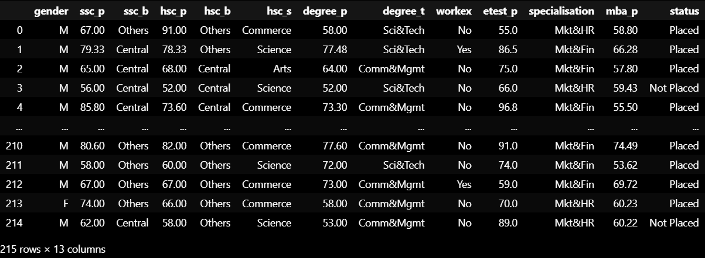
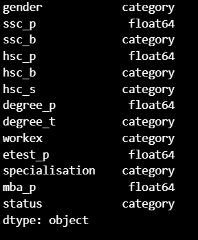
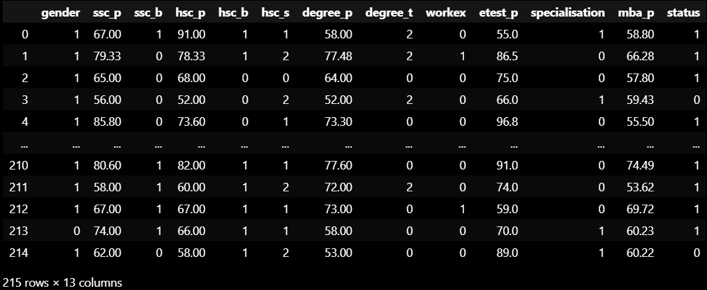
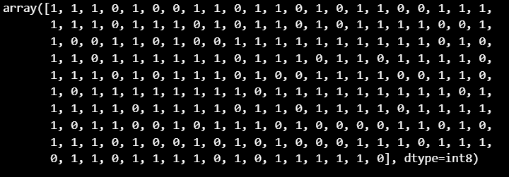

# Implementation-of-Logistic-Regression-Using-Gradient-Descent

## AIM:
To write a program to implement the the Logistic Regression Using Gradient Descent.

## Equipments Required:
1. Hardware – PCs
2. Anaconda – Python 3.7 Installation / Jupyter notebook

## Algorithm
1. Import the required libraries.
2. Load the dataset.
3. Define X and Y array.
4. Define a function for costFunction,cost and gradient.
5. Define a function to plot the decision boundary. 6.Define a function to predict the 
   Regression value.

## Program:
```
/*
Program to implement the the Logistic Regression Using Gradient Descent.
Developed by: Bharath Raj P
RegisterNumber:  212223230031
*/
import pandas as pd 
import numpy as np 
import matplotlib.pyplot as plt 
data=pd.read_csv("placement.csv")  
data=data.drop('sl_no',axis=1) 
data=data.drop('salary',axis=1) 
data
data["gender"]=data["gender"].astype('category') 
data["ssc_b"]=data["ssc_b"].astype('category') 
data["hsc_b"]=data["hsc_b"].astype('category') 
data["degree_t"]=data["degree_t"].astype('category') 
data["workex"]=data["workex"].astype('category') 
data["specialisation"]=data["specialisation"].astype('category') 
data["status"]=data["status"].astype('category') 
data["hsc_s"]=data["hsc_s"].astype('category') 
data.dtypes
data["gender"]=data["gender"].cat.codes 
data["ssc_b"]=data["ssc_b"].cat.codes 
data["hsc_b"]=data["hsc_b"].cat. codes
data["degree_t"]=data["degree_t"].cat.codes 
data["workex"]=data["workex"].cat.codes 
data["specialisation"]=data["specialisation"].cat.codes 
data["status"]=data["status"].cat.codes 
data["hsc_s"]=data["hsc_s"].cat.codes 
data 
x=data.iloc[:,:-1].values 
y=data.iloc[:,-1].values
y 
theta = np.random.randn(x.shape[1]) 
Y=y 
def sigmoid(z): 
   return 1/(1+np.exp(-z))
def loss(theta,X,y): 
   h=sigmoid(X.dot(theta))
   return -np.sum(y*np.log(h)+(1-y)*np.log(1-h)) 
def gradient_descent(theta,X,y,alpha,num_iterations): 
    m=len(y)
    for i in range(num_iterations): 
        h=sigmoid(X.dot(theta)) 
        gradient = X.T.dot(h-y)/m 
        theta-=alpha * gradient 
        return theta
gradient_descent(theta,x,y,alpha=0.01,num_iterations=1000) 
def predict(theta,X): 
    h=sigmoid(X.dot(theta)) 
    y_pred=np.where(h>=0.5,1,0) 
    return y_pred 
y_pred = predict(theta,x) 
accuracy=np.mean(y_pred.flatten()==y)
print("Accuracy: ",accuracy) 
print(y_pred)
xnew=np.array([[0,87,0,95,0,2,78,2,0,0,1,0]]) 
y_prednew=predict(theta,xnew) 
print(y_prednew) 
xnew=np.array([[0,0,0,0,0,2,8,2,0,0,1,0]]) 
y_prednew=predict(theta,xnew) 
print(y_prednew)

```

## Output:
## Dataset :


## Information :


## Encoding:


## X and Y value:



## Gradient Descent:


## Accuracy:


## Prediction:


## Result:
Thus the program to implement the the Logistic Regression Using Gradient Descent is written and verified using python programming.

